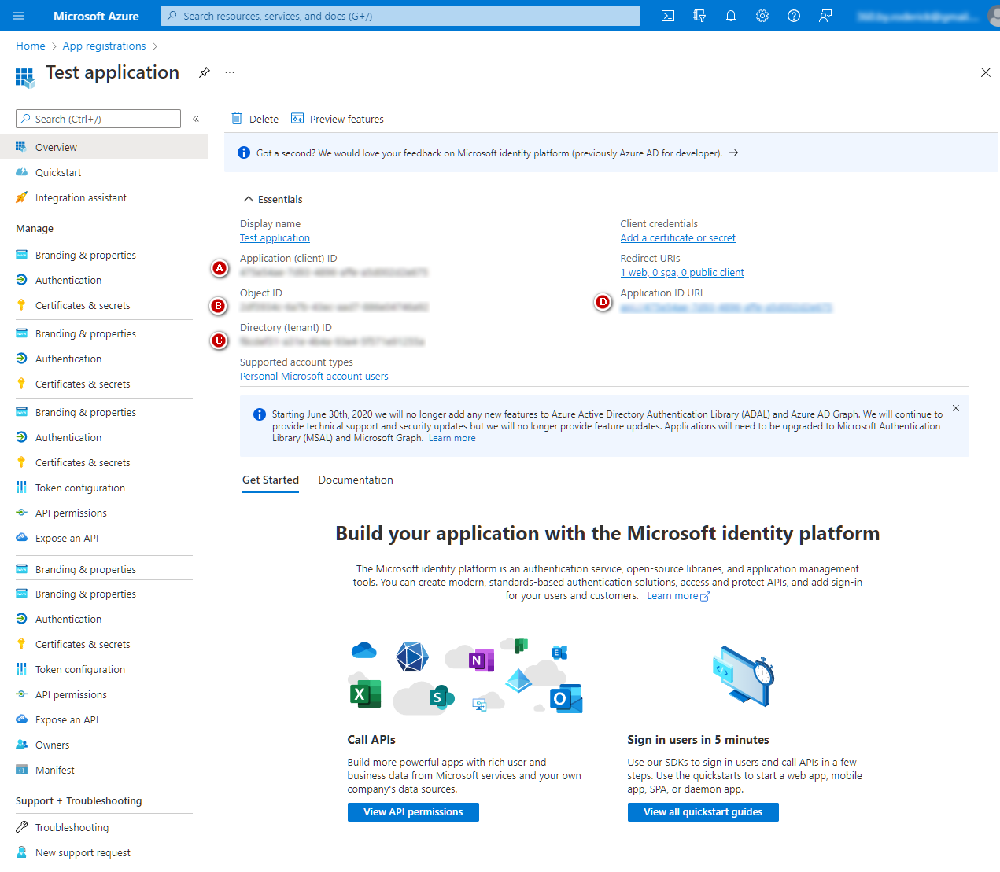
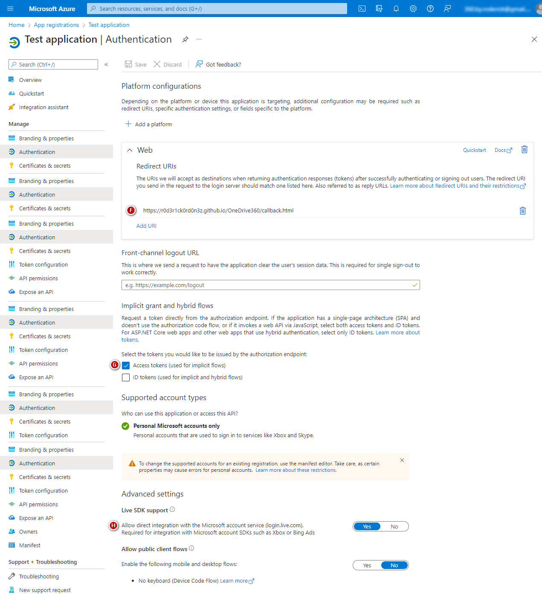
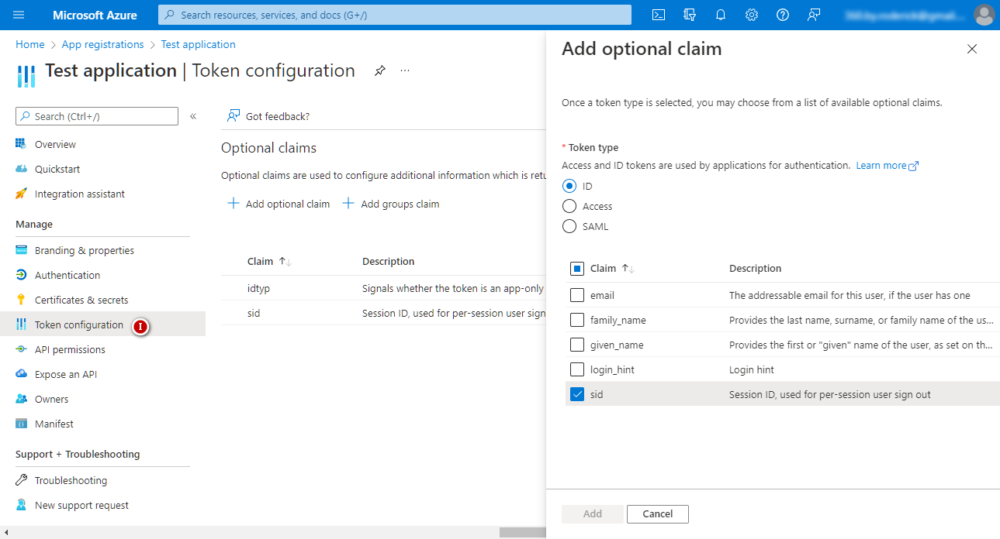
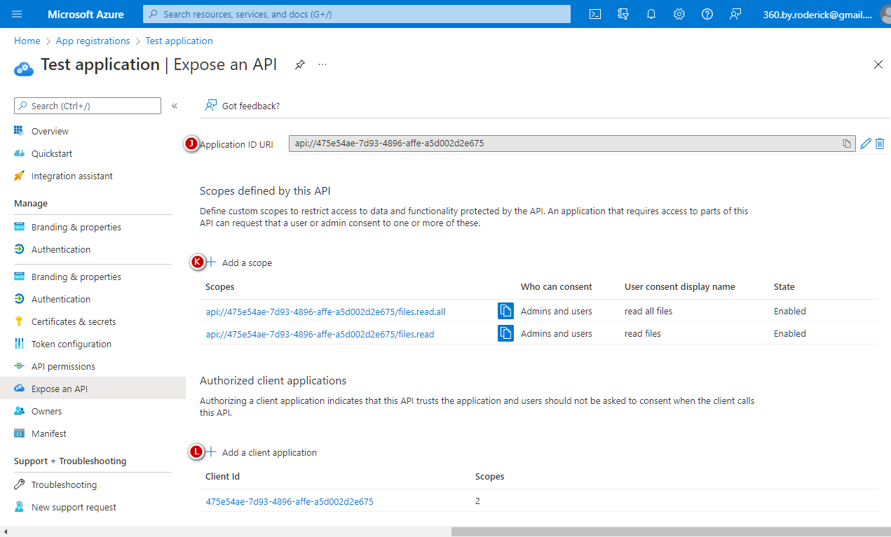

## OneDrive Explorer sample web app

This is a modified version of the following GitHub repository:
* https://github.com/OneDrive/onedrive-explorer-js

I've copied only the relevant files, and updated the code to work with a OneDrive personal account. To see it in action, see the following link:
* https://r0d3r1ck0rd0n3z.github.io/File-explorer-demo-for-OneDrive-personal/

To test the login, click the 'Sign in to OneDrive' link on the upper right.

&nbsp;
## This demo requires an MS Azure account

You need to sign up for a Microsoft Azure account to add your own keys and scope. I'm sharing my settings here. Click on a title to view a screenshot of my settings.

1️⃣ Create a new Microsoft Azure project

  

* 
 

2️⃣ Set up Authentication settings

  

* 
 

3️⃣ Configure tokens and optional claims

  

* 
 

4️⃣ Expose APIs for the related scopes

  

* 
 

&nbsp;
## Configuration

Note that the demo won't work when you move or copy the files to another repository. This is because the authorization process is bound to my personal MS Azure account. To resolve, replace all instances of the following placeholders (both in the js and html files) with the values you provided during the creation/registration of your MS Azure app:

* <tt>YOUR_CLIENT_ID__</tt>
* <tt>YOUR_REDIRECTURL</tt>
* <tt>YOUR_SCOPES_HERE</tt>
        
        
&nbsp;
## Original description

The original description is given below:

> This sample illustrates the basic concepts for interacting with OneDrive via Microsoft Graph API to create a file explorer web app.

For license information, head over to the source:
* https://github.com/OneDrive/onedrive-explorer-js
